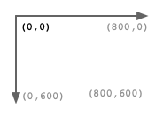
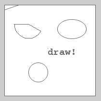
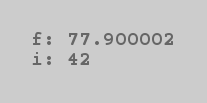
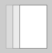
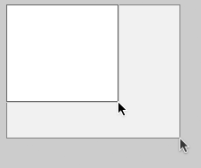
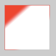

# Simple Teaching Assistant

## Why?

The Simple Teaching Assistant helps teaching programming.
Our students will become engineers, so we chose `C` as language.
But there is an allure to projects like [Processing](https://processing.org/), which teach programming a little more visual – and a little less black matrix.

The Simple Teaching Assistant takes the edge off of _graphical_ programming by providing a ready-made environment.
The provided framework lets the student easily create graphical solutions and compile them.
The framework offers a set of drawing functions and a `setup`/`draw` structure similar to [Processing's](https://processing.org/examples/loop.html).
It is based on [SDL 2](https://www.libsdl.org/).

**Why write a wrapper around SDL?**
First semester students typically don't know about double buffering, window handles or texture rendering.
The thin wrapper removes the need for explaining such things and arms the students with tools to solve (visual) problems.
We – teachers – can focus on explaining the stuff that really counts: problem solving.

## Prerequisites

**On Mac**, you can install the prerequisites via [homebrew](http://brew.sh/):  `brew install git sdl2 sdl2_gfx sdl2_ttf`. Please make sure your compiler (llvm/gcc) is up to date.

**On Linux** (Ubuntu), I installed the following packages: `sudo apt-get -y install git build-essential libsdl2-dev libsdl2-gfx-dev libsdl2-ttf-dev`.
If you have to use Ubuntu 14.04 or earlier, please scroll down and see the troubleshooting section.

Or do it **without a package manager** and follow the instructions on these respective sites: [git](https://git-scm.com/), [SDL 2](https://www.libsdl.org/download-2.0.php) and [SDL GFX](http://cms.ferzkopp.net/index.php/software/13-sdl-gfx).

For offline usage (one student always has problems with wifi), it is highly encouraged to check out a local copy of the repository.
To do so, please go to:

```bash
sudo git clone https://github.com/motine/sta.git /usr/local/sta.git
# later the teacher can help and start a new project from the local repo:
# => git clone /usr/local/sta.git myproject
```

If you want to update the local repository or an existing project you can run `git pull` in the respective folder.

## Get started

We create a new project with:

```bash
cd ~/Documents
git clone https://github.com/motine/sta.git myproject # Creates a new folder: ~/Documents/myproject and copies the framework
```

The most important file is named `project.c`. This is where the student puts his/her solution. It starts off looking something like this:

```c
#include "sketchbook.h"

void setup() {
  // do initialization here
}

void draw() {
  // this will be repeated on and on and on...
  rectangle(10, 10, 100, 100);
}
```

Now, we compile and run:

```bash
cd ~/Documents/myproject # let's not forget that we have to go to the project first
make # runs gcc with all the -I and -l options and writes the executable to 'project'
# ... output of GCC ...
./project # opens a window and shows a rectangle
```

If this all works fine and dandy, we can start changing our `setup` and `draw` methods.

# Sketchbook

The framework, which is used by including `sketchbook.h`, provides a `main` function.
By default, it brings up a 800 x 600 px wide window.



It calls the `setup` method once before the drawing starts. It can be used to do initialization.

To see something on the screen, we need to write a `draw` method.
This method is called 25 times a second (if the computer is fast enough).
All drawing code is executed and the final picture is put on the screen right after the method has finished.
It is highly discouraged to use delay or similar functions in the `draw` method.
This interferes with keyboard, mouse and other handlers.

## Overview / API

_For simplicity all types like `uint8_t` have been replaced with common standard types like `unsigned short`. The actual function definition in the header file may differ_

**Program flow**

```c
// Called once before the calls to `draw` start.
void setup(); // !! This method must be provided by the student (in the `project.c` file).
// This method is called over and over again.
// Right before the screen is emptied, right after all the drawing is put on the screen. 
void draw(); // !! This method must be provided by the student (in the `project.c` file)

// Change the intended frame rate. Usually used in the setup() function.
// Don't use values higher than 25.0 unless you are sure your computer(s) are fast enough.
void fps(float target_frames_per_sec);
// Stop the calls to `draw`. The result of the current `draw` will be kept on the screen forever.
void stop();
// Terminate the application after the current `draw`.
void quit();
```

**Drawing**

```c
// Get the window's dimensions
WIDTH
HEIGHT

// Set fill color for drawing future shapes. Each RGB component shall be between 0..255.
void fill(unsigned short r, unsigned short g, unsigned short b);
// Disable filling shapes.
void no_fill();
// Set stroke color for drawing future shapes. Each RGB component shall be between 0..255.
void stroke(unsigned short r, unsigned short g, unsigned short b);
// Disable stroking future shapes.
void no_stroke();

// Draws a line from (x1, y1) to (x2, y2) with the stroke color.
void line(unsigned int x1, unsigned int y1, unsigned int x2, unsigned int y2);
// Draws a rectangle from (x1, y1) to (x2, y2).
void rectangle(unsigned int x1, unsigned int y1, unsigned int x2, unsigned int y2);
// Draws an ellipse around (x, y) with the radius of rx and ry.
void ellipse(unsigned int x, unsigned int y, unsigned int rx, unsigned int ry);
// Draws a circle with its midpoint at (x, y) and radius r.
void circle(unsigned int x, unsigned int y, unsigned int r);
// Draws a pie piece around the midpoint (x,y) and radius r. Start and end angle are given in degrees
void pie(unsigned int x, unsigned int y, unsigned int r, unsigned int start, unsigned int end);
// Sets the given pixel to the stroke color.
void pixel(unsigned int x, unsigned int y);

// Draws the given text at (x,y), using the stroke color.
void text(unsigned int x, unsigned int y, const char* text);

// Set the background color through RGB values from 0..255. It is used to clear the screen before each `draw()` call.
// Usually, you would use this call within the `setup()` function.
void background(unsigned short r, unsigned short g, unsigned short b);
```
  
**Input & Output**
  
```c
// Returns the current x mouse coordinate.
unsigned int mouse_x();
// Returns the current y mouse coordinate.
unsigned int mouse_y();
// Returns true if the left mouse button is pressed.
bool mouse_pressed();

// Returns the character which is currently pressed on the keyboard.
// We can only recognize lowercase alphabetic letters and numbers ('a', 'b', 'c', ..., 'z', '0', '1', ..., '9').
// Key modifiers are not considered (shift, ctrl, alt, etc.).
// If none is pressed, this function returns 0.
char key_pressed();

// Please see "Internals" section for enabling screenshot output.
```

**Timeline**

```c
// Returns the number of milliseconds passed since the program started.
unsigned long long millis();

// Returns the number of the frame which is currently drawn.
// The result of the first draw method has frame index 0, the next 1, ...
unsigned long long frame_index();

// shows the current frame rate (per second) as debug output.
// Please call only once per draw().
void show_fps();
```

**Debugging**

```c
// Add a inspection to the debug overlay ("prefix: value").
// Right before the draw function is called, the overlay will be cleared.
// This means this method can be called multiple times during draw, but only the inspections added in the last draw will be shown.
// The overlay will be drawn after the draw method ran.
void debug(const char* prefix, TYPE value); // where TYPE can be any number or a string
// If the type is not recognized the value printed as pointer.
```

**Useful stuff from other libraries**

```c
// Sketchbook includes `stdbool.h`. It defines the type
bool // and the values
false	// as 0
true	// as 1

// minimum and maximum values
MIN(X, Y);
MAX(X, Y);

// Returns a pseudo-random number between ​0​ and the highest positive number of int.
int rand(); // You don't need to worry about calling srand(). Sketchbook does it automatically for you.
// Hint: Use something like `x = rand() % 100` to get numbers beween 0 and 99.

// Sketchbook includes the `math.h` library. Please see the API here: http://devdocs.io/c/numeric/math
double fabs(double x); // All sorts of trigonometric functions
double sin(double x);
double cos(double x);
double tan(double x);
M_PI // And the value of PI

// Sketchbook also includes the whole `SDL.h` library with `SDL2_gfxPrimitives.h`. Please refrain from using the methods directly though.
// It also uses `stdint.h` in its headers.
```

## Examples

### Sketching functions



```c
#include "sketchbook.h"

void setup() {
  // do initialization here
}

void draw() {
  // this will be repeated on and on and on...
  rectangle(10, 10, 200, 200);
  line(10, 20, 40, 10);
  ellipse(150, 60, 30, 20);
  circle(80, 150, 20);
  pie(60, 50, 30, 30, 180);
  pixel(100, 100);
  text(100, 100, "draw!");
}
```

### Debugging



Debugging can be hard. One should consider to use a real debugger such a `gdb`.
But, since the usage of such tools can be daunting, let's use the good old `printf` debugger.
This means, we let the values of the variables in question show up on the screen.
Simply add an inspection with the `debug` method.
All inspections will be remembered and overlaid right after the `draw` method.
The inspections are then cleared to have a fresh start right before the next `draw` call.

```c
// ...
void draw() {
  float f = 77.9;
  int i = 42;
  // ...your complicated calculation goes here...
  debug("f", f);
  debug("the crass value of i", i);
  // will show an overlay similar to the one above
}
```

### Frame rate



The drawing sketchbook will ensure that there is a frame rate of 50 frames per second (if the computer is fast enough).
This ensures we have a near constant time between frames and the frame duration does not vary much (e.g. because of processors load).

```c
// ...
static int i = 0;
void draw() {
  rectangle(i % 100, 10, 100, 100);
  i++;
}
```

### Mouse & Keyboard



For the sake of simplicity, there is no event listening or event polling.
Yet, there are functions to ask for the current mouse coordinates.
Also, you can check which key is currently pressed.
_Limitation: We can only recognize lowercase alphabetic letters and numbers. Key modifiers are also not considered (e.g. shift, ctrl, alt)._

```c
// ...
void draw() {
  rectangle(10, 10, mouse_x(), mouse_y());
}
```



Handling buttons and keys is done like this:

```c
// ...
void draw() {
  if (mouse_pressed()) { // checks if the left mouse button is pressed
    stroke(255, 0, 0);
  } else {
    stroke(200, 200, 200);
  }
  if (key_pressed() == 'a') { // checks if the A key is pressed
    fill(255, 0, 0);
  } else {
    fill(255, 255, 255);
  }
  
  rectangle(10, 10, 100, 100);
}
```

When using `key_pressed()` for text input, you may encounter that it will always –not just once– return the key currently pressed.
Sometimes this is not desirable, because you may want to handle a key press only once.
Here a little trick how to achive the "once-only" behaviour:

```c
char input[100] = "";
char last_key = 0;

void draw() {
  char key = key_pressed();
  if (key && (last_key != key)) { // this is only true once per key press
    int last_char = strlen(input);
    input[last_char] = key; // add the key to the input
    input[last_char+1] = '\0'; // let's not forget zero-termination of strings
  }
  last_key = key; // save the current key, so we can check if it differs in the next draw call

  text(10, 10, input);
}
```

### Coloring


_These are the worst colors a human ever chose..._

```c
#include "sketchbook.h"

void setup() {
  // do initialization here
}

void draw() {
  stroke(255, 0, 0); // apply stroke for all subsequent shapes
  line(10, 20, 40, 10); // appears red

  fill(0, 255, 0); // apply fill for all following shapes
  rectangle(10, 10, 150, 150); // has a green background and still red stroke

  stroke(0, 0, 255);
  no_fill(); // disable filling
  circle(50, 50, 20); // appears with blue stroke and not no fill

  no_stroke(); // disable stroking
  circle(10, 10, 10); // this is invisible
  
  stroke(0, 0, 0);
  pixel(100, 100); // adds three black pixels
  pixel(102, 100);
  pixel(104, 100);
}
```

## Performance test

In this little program you can tweak the ITERATIONS constant to check out when your frame rate starts to decline.
The constant determines how many drawing operations are done per draw cycle.

```c
#include "sketchbook.h"

void setup() {}

const unsigned ITERATIONS = 500;
void draw() {
  show_fps();
  for (int i=0; i < ITERATIONS; i++) {
    int x = rand() % 700;
    int y = rand() % 500;
    rectangle(x, y, x+100, y+100);
  }
}
```

# Troubleshooting

We need a `gcc` version `>= 4.9` for using generics. Maybe you got this error:

```
gcc: error: unrecognized command line option ‘-fdiagnostics-color=always’
make: *** [project.o] Error 1
```

`gcc >= 4.9` is the default for Ubuntu `>=15.04`. 

```bash
# Only on Ubuntu 14.04
sudo add-apt-repository -y ppa:ubuntu-toolchain-r/test
sudo apt-get update
sudo apt-get install gcc-4.9
sudo update-alternatives --install /usr/bin/gcc gcc /usr/bin/gcc-4.9 50
```

# Internals

**Exporting screenshots**
I usally create animated GIFs from program submissions.
You can can call the executable with the `-s` switch (e.g. `./project -s`).
Then the all frames will be exported to the `shots` folder.

You can also use `make shots`. Though, you need [ImageMagick](http://www.imagemagick.org/script/index.php) installed (under Ubuntu run: `sudo apt-get install imagemagick`).
The `make` command will run the project with `-s`. You can terminate the program when you have enough material.
Then make will create an animated GIF and leave it under `shots.gif`.
Since those files are usually quite large I use [GIF Brewery](http://gifbrewery.com/) to edit them.

**Vagrant**
For testing the environment of the students I am using a vagrant machine.
To start the minimalistic window manager please run `sudo startxfce4` in the GUI.
For the full blown gnome run `sudo startx`.

**Code style**
To enforce code style please use `clang-format -style='{ BasedOnStyle: Chromium, ColumnLimit: 200 }' -i filename.c`. This command will use the `.clang-format` config and replace without asking.
To check a number of files, please use `for i in *.c; do echo "------------- $i"; clang-format -style='{ BasedOnStyle: Chromium, ColumnLimit: 200 }' $i | diff - $i; done | mate`.

## Disclaimer

I am aware that some of the choices I made are quite opinionated.
Two examples are: I am providing a main function in a module (_ugh_) and I am using fixed [FPS](https://en.wikipedia.org/wiki/Frame_rate) and not a decent time difference method.
These two choices – and many others – were made because I think they make teaching simpler.
I guess these simplifications should be considered carefully for any real world project.

<!--
TODO add error checking everywhere
TODO Add style guides/rubocop + the same for c
TODO Add resume when r is pressed?
-->
