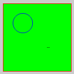

# Drawing

TODO write intro

## Overview

TODO add API docs / include header
TODO don't forget the functions and constants in sketchbook and misc (e.g. WIDTH)!

TODO document random (this is part of stdlib.h).

## Setup and draw

the drawing will only be shown on the screen after `draw`.

## Sketching functions


```c
#include "sketchbook.h"
#include "drawing.h"
#include "misc.h"

void setup() {
  // do initialization here
}

void draw() {
  // this will be repeated on and on and on...
  rectangle(10, 10, 200, 200);
  line(10, 20, 40, 10);
  ellipse(150, 60, 30, 20);
  circle(80, 150, 20);
  pie(60, 50, 30, 30, 180);
  pixel(100, 100);
}
```

## Frame rate


The drawing sketchbook will ensure that there is a frame rate of 50 frames per second.
This ensures we have a near constant time between frames and the frame duration does not vary depending on the processors load.

```c
// ...
static int i = 0;
void draw() {
  rectangle(i % 100, 10, 100, 100);
  i++;
}
```

## Coloring



_These are the worst colors a human ever chose..._

```c
#include "sketchbook.h"
#include "drawing.h"
#include "misc.h"

void setup() {
  // do initialization here
}

void draw() {
  stroke(255, 0, 0); // apply stroke for all subsequent shapes
  line(10, 20, 40, 10); // appears red

  fill(0, 255, 0); // apply fill for all following shapes
  rectangle(10, 10, 150, 150); // has a green background and still red stroke

  stroke(0, 0, 255);
  no_fill(); // disable filling
  circle(50, 50, 20); // appears with blue stroke and not no fill

  no_stroke(); // disable stroking
  circle(10, 10, 10); // this is invisible
  
  stroke(0, 0, 0);
  pixel(100, 100); // adds three black pixels
  pixel(102, 100);
  pixel(104, 100);
}
```